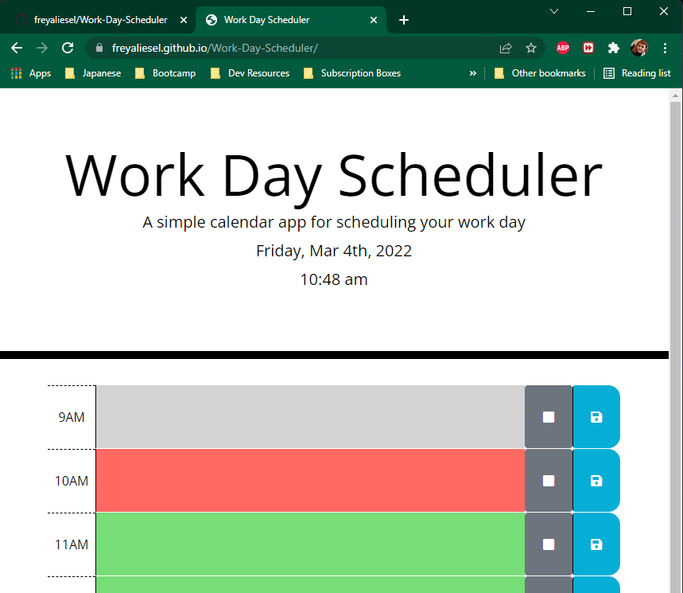

# Week 5 - Work Day Scheduler

Assignment is to build on top of base code, and use JQuery and a date utility library to make a single-day schedule application.


>## User Story
>
>```md
>AS AN employee with a busy schedule
>I WANT to add important events to a daily planner
>SO THAT I can manage my time effectively
>```
>
>## Acceptance Criteria
>
>```md
>GIVEN I am using a daily planner to create a schedule
>WHEN I open the planner
>THEN the current day is displayed at the top of the calendar
>WHEN I scroll down
>THEN I am presented with timeblocks for standard business hours
>WHEN I view the timeblocks for that day
>THEN each timeblock is color coded to indicate whether it is in the past, present, or future
>WHEN I click into a timeblock
>THEN I can enter an event
>WHEN I click the save button for that timeblock
>THEN the text for that event is saved in local storage
>WHEN I refresh the page
>THEN the saved events persist
>```

I went beyond spec and added additional features:

+ Check for schedule diregards saved schedule if the date is not current date
+ Added Clock displaying user's local time
+ App auto saves tasks on the hour
+ App updates html on the hour


Repo is located at [GitHub/freyaliesel](https://github.com/freyaliesel/Work-Day-Scheduler)


